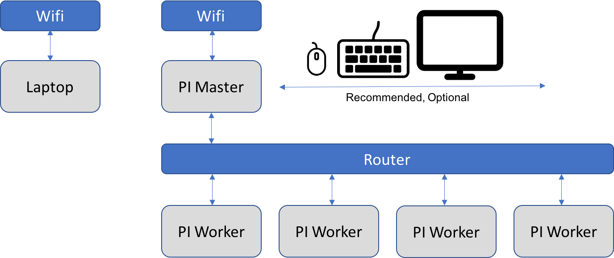

# Cloudmesh Pi Burner for SD Cards

**WARNING:** *This program is designed for a Raspberry Pi and must not be
executed on your laptop or desktop. An earlier version that could be run on Linux, 
macOS, and Windows 10 is NO LONGER supported. If you want to help us porting them 
on any of these OSes, please contact laszewski@gmail.com*


[](https://travis-ci.org/TankerHQ/cloudmesn-pi-burn)
[](https://pypi.org/project/cloudmesh-pi-burn)
[](https://pypi.org/project/cloudmesh-pi-burn/)
[](https://github.com/TankerHQ/python-cloudmesh-pi-burn/blob/main/LICENSE)


<!--TOC-->

- [Cloudmesh Pi Burner for SD Cards](#cloudmesh-pi-burner-for-sd-cards)
  - [cms burn](#cms-burn)
  - [See Also](#see-also)
  - [Quick Start](#quick-start)
    - [Requirements](#requirements)
    - [Setup](#setup)
    - [Single Card Burning](#single-card-burning)
    - [Burning Multiple SD Cards with a Single Burner](#burning-multiple-sd-cards-with-a-single-burner)
    - [Connecting Pis Together](#connecting-pis-together)
  - [STUFF TO BE DELETED OR INTEGRATED IN REST OF DOCUMENT](#stuff-to-be-deleted-or-integrated-in-rest-of-document)
  - [Manual](#manual)
  - [Step 4(alt). Burning Multiple Cards](#step-4alt-burning-multiple-cards)
  - [DEPRECATED. DO NOT GO BEYOND THIS LINE AS THE DOCUMENTATION IS OUT OF DATE](#deprecated-do-not-go-beyond-this-line-as-the-documentation-is-out-of-date)
    - [Installation](#installation)
    - [Information about the SD Cards and Card Writer](#information-about-the-sd-cards-and-card-writer)
    - [Finding Image Versions](#finding-image-versions)
    - [Downloading an Image](#downloading-an-image)
    - [ROOT](#root)
    - [Creating Cluster SD-Cards](#creating-cluster-sd-cards)
    - [Burning SD-Cards](#burning-sd-cards)
    - [Auto Format to FAT32](#auto-format-to-fat32)
    - [Note on using a static IP address](#note-on-using-a-static-ip-address)
    - [From the raspberry FAQ](#from-the-raspberry-faq)

<!--TOC-->

## cms burn

`cms burn` is a program to burn many SD cards for the preparation of
building clusters with Raspberry Pi's. It allows users to
create readily bootable SD cards that have the network configured,
contain a public ssh key from your machine that you used to configure
the cards. Thus not much additional setup is needed. Another unique 
feature is that you can burn multiple cards in a row, each with their 
individual setup such as hostnames and ipadresses.

A sample command invocation looks like:

```
cms burn create --hostname=red[001-002]
```

This command will burn 2 SD cards with the names red001 and red002.


## See Also

Some older documentation, much of it is still relevant, is available
at the following links. We will in time integrate here or update them.

**NOTE:** We also have additional information just started on how to
install a kubernetes cluster. This however doe not yet work. See
[kubernetes cluster instalation guide.](https://github.com/cloudmesh/cloudmesh-pi-cluster/tree/main/cloudmesh/pi/cluster/k3)
for k3s program documentation.

**NOTE**: [Old manual documentation](https://cloudmesh.github.io/cloudmesh-manual/projects/project-pi-burn.html?highlight=burn)

## Nomenclature

* Commands proceeded with `pi@red:$` are to be executed on the Rasperry
  Pi with the name red.

* Commands with `(ENV3) pi@red:$` are to be executed in a virtula ENV
  using Python 3 on the Raspberry Pi with the name red

* Commands with `raspberry$` only are to be executed on your burner pi
  that is not a Pi.
  
## Quickstart

To provide you with a glimps oon what you can do with cms burn, we have 
provided this quickstart guide that will create one managment PI and several 
workers.


### Requirements

For the quickstart we have the following requirements:

* To simplify things we assume you have one more SD Cards than you have 
  Raspberry PIs. (However, its also possible that you can do this also with the 
  exact number of cars as you have PI's. But its far easier if you just get one more card).
  
* Burner Pi: You will need at least **1 Raspberry Pi** SD Card burned 
  using [Raspberry Pi imager](https://www.raspberrypi.org/software/). 
  You can use your normal operating system to burn such a card including Windows, macOS, or Linux. 
  Setting up a Raspberry Pi in this manner should be relatively straightforward 
  as it is nicely documented online (For example, 
  [how to setup SSH](https://www.raspberrypi.org/documentation/remote-access/ssh/)). 
  All you will need for this guide is an internet connection for your Pi.

* You will need an SD card writer (USB tends to work best) to burn new cards
  We recommend that you invest in a USB3 SDCard writer as they are significantly 
  faster and you can resuse them on PI'4s

### Burner Pi

First, we set up a regular Raspberry PI on our extra SD Card. This Pi will be 
explicitly only used for burning. Although you could also set it up on the 
Manager PI we prefer using this additional card to simplify the setup.

How to set up this Burner PI is discussed in the Requirements section and 
you may already have one such SD Card from other experiments you did with a PI.

Step 1. Installing Cloudmesh on the Burner Pi

The simple curl command below will generate an ssh-key, update your system, 
and install cloudmesh.

```
pi@raspberrypi:~ $ curl -Ls http://cloudmesh.github.io/get/pi | sh
```

This will take a moment...

Step 2. Activate Python Virtual Environment

If you have not already, enter the Python virtual environment provided by 
the installation script.

```
pi@raspberrypi:~ $ source ~/ENV3/bin/activate
```

Step 3. Detecting the card burner

Run the detect command as follows:

```
(ENV3) pi@raspberrypi:~ $ cms burn detect
```

This command will prompt the user with instructions on how to mount 
the SD card burner on the Pi. You should also have your SD card 
inserted into the burner at this time.

If all is done correctly, running the following command will return 
the path to the card burner.

```
(ENV3) pi@raspberrypi:~ $ cms burn info
```

Here is a snippet from the returned lines:

```
# ----------------------------------------------------------------------
# SD Cards Found
# ----------------------------------------------------------------------

+----------+----------------------+----------+-----------+-------+------------------+---------+-----------+-----------+
| Path     | Info                 | Readable | Formatted | Empty | Size             | Aaccess | Removable | Writeable |
+----------+----------------------+----------+-----------+-------+------------------+---------+-----------+-----------+
| /dev/sda | Generic Mass-Storage | True     | True      | False | 31.9 GB/29.7 GiB | True    | True      |           |
+----------+----------------------+----------+-----------+-------+------------------+---------+-----------+-----------+
```

We can see that the path to our burner is `/dev/sda`. Let us export 
this as an environment variable for access by the burn program.

```
(ENV3) pi@raspberrypi:~ $ export DEV=/dev/sda
```

Of course, your path may be different.

Step 4. Retrieving a Raspbian Lite Image (Only needs to be done once per 
image version)

Currently, we burn our SD cards with Raspbian Lite, as desktop is not 
needed for cluster nodes. We can retrieve the latest version of 
raspbian lite as follows:

```
(ENV3) pi@raspberrypi:~ $ cms burn image get latest
```

This will take a few moments...

We can also use this command to get specific versions of Raspbian Lite. 
This will be included in this guide at a future date.

Your burner Pi is now ready to burn SD cards.


### Single Card Burning

Step 0. Ensure the SD card is inserted.

We can run `cms burn info` again as we did above to verify our 
SD card is connected.

Step 1. Burning the SD Card

Choose a hostname for your card. We will use `red001`.
```
(ENV3) pi@raspberrypi:~ $ cms burn create --hostname=red001
```
Wait for the card to burn. Once the process is complete, it is safe 
to remove the SD card.


### Burning Multiple SD Cards with a Single Burner

Step 0. Ensure the first SD card is inserted into the burner.

We can run `cms burn info` again as we did above to verify our SD 
card is connected.

Step 2. Burning the Cards

`cms burn` supports logical incremenation of numbers/characters.

For example, `red00[1-2]` is interpreted by cms burn as `[red001, red002]`.
Similarly, `red[a-c]` is interpreted by cms burn as `[reda, redb, redc]`.

We can burn 2 SD cards as follows:

```
(ENV3) pi@raspberrypi:~ $ cms burn create --hostname=red00[1-2]
```

The user will be prompted to swap the SD cards after each card burn if 
there are still remaining cards to burn.


QUESTION: Do we not also need the ip address? Why burn if we do not have 
network, or is this working with DHCP?

### Connecting Pis Together

`cms burn` will setup a simple network on all cluster nodes
configured. There are different models for networking configuration we
could use.  However we have decided for one that allows you to
interface with your local Laptop to the cluster via Wifi.  The setup
is illustrated in Figure Networking.



Figure: Networking

We assume that you have used `cms burn` to create all SD cards for the
Pi's.

The Pi used to burn the cards is known as `Pi Master` in the figure above.

Once your setup is configured in this manner, Pi Master should be able to ssh 
into each node via its hostname. For example, if one of our workers is 
`red001`, we may ssh to them as follows:

```
(ENV3) pi@raspberrypi:~ $ ssh pi@red001.local
```

> Note: To figure out when a Pi is done completing its initial bootup process, 
> the green light on the Pi will remain on until the bootup/setup is complete. 
> Once there is just a solid red light, the Pi is ready.


## Manual

<!--MANUAL-->
```
  burn network list [--ip=IP] [--used]
  burn network
  burn info [DEVICE]
  burn detect
  burn image versions [--refresh]
  burn image ls
  burn image delete [IMAGE]
  burn image get [URL]
  burn create [--image=IMAGE]
                         [--device=DEVICE]
                         [--hostname=HOSTNAME]
                         [--ipaddr=IP]
                         [--sshkey=KEY]
                         [--blocksize=BLOCKSIZE]
                         [--dryrun]
                         [--passwd=PASSWD]
                         [--ssid=SSID]
                         [--wifipassword=PSK]
                         [--format]
  burn burn [IMAGE] [DEVICE] --[dryrun]
  burn mount [DEVICE] [MOUNTPOINT]
  burn set host [HOSTNAME] [MOUNTPOINT]
  burn set ip [IP] [MOUNTPOINT]
  burn set key [KEY] [MOUNTPOINT]
  burn enable ssh [MOUNTPOINT]
  burn unmount [DEVICE]
  burn wifi SSID [PASSWD] [-ni]

Options:
  -h --help              Show this screen.
  --version              Show version.
  --image=IMAGE          The image filename,
                         e.g. 2019-09-26-raspbian-buster.img
  --device=DEVICE        The device, e.g. /dev/mmcblk0
  --hostname=HOSTNAME    The hostname
  --ipaddr=IP            The IP address
  --key=KEY              The name of the SSH key file
  --blocksize=BLOCKSIZE  The blocksise to burn [default: 4M]

Files:
  This is not fully thought through and needs to be documented
  ~/.cloudmesh/images
    Location where the images will be stored for reuse

Description:
    cms burn create --passwd=PASSWD

         if the passwd flag is added the default password is
         queried from the commandline and added to all SDCards

         if the flag is ommitted login via the password is disabled
         and only login via the sshkey is allowed

  Network

    cms burn network list

        Lists the ip addresses that are on the same network

         +------------+---------------+----------+-----------+
         | Name       | IP            | Status   | Latency   |
         |------------+---------------+----------+-----------|
         | Router     | 192.168.1.1   | up       | 0.0092s   |
         | iPhone     | 192.168.1.4   | up       | 0.061s    |
         | red01      | 192.168.1.46  | up       | 0.0077s   |
         | laptop     | 192.168.1.78  | up       | 0.058s    |
         | unkown     | 192.168.1.126 | up       | 0.14s     |
         | red03      | 192.168.1.158 | up       | 0.0037s   |
         | red02      | 192.168.1.199 | up       | 0.0046s   |
         | red        | 192.168.1.249 | up       | 0.00021s  |
         +------------+----------------+----------+-----------+

    cms burn network list [--used]

        Lists the used ip addresses as a comma separated parameter
        list

           192.168.50.1,192.168.50.4,...

    cms burn network address

        Lists the own network address

         +---------+----------------+----------------+
         | Label   | Local          | Broadcast      |
         |---------+----------------+----------------|
         | wlan0   | 192.168.1.12   | 192.168.1.255  |
         +---------+----------------+----------------+

Examples: ( \ is not shown)

   > cms burn create --image=2019-09-26-raspbian-buster-lite
   >                 --device=/dev/mmcblk0
   >                 --hostname=red[5-7]
   >                 --ipaddr=192.168.1.[5-7]
   >                 --sshkey=id_rsa

   > cms burn image get latest

   > cms burn image get https://downloads.raspberrypi.org/
   >   raspbian_lite/images/
   >   raspbian_lite-2018-10-11/2018-10-09-raspbian-stretch-lite.zip

   > cms burn image delete 2019-09-26-raspbian-buster-lite

```
<!--MANUAL-->


## STUFF TO BE DELETED OR INTEGRATED IN REST OF DOCUMENT


In this example we will set up a network of Raspberry Pi's. In our
example we will set up a cluster with 3 Pi's. We have the following
assumptions:

* We assume you have at at least 3 Raspberry Pi's. This will provide
  you in our example with a master and two worker Pi's. However if you
  have more, you can use more by adding more worker Pi's. Please adapt
  our example accordingly. The minimum number of workers is 1.

* We assume you will use the hostname for the master to be `red`, and
  for the workers you will use `red[001-002]`.

* We assume that you have one more SD Card than you have PI's. If not
  you need to reinstall the burn program on that master. and use that
  reburned SD card.

* We assume that you have an SD card writer. We wecommend that you get
  one that is USB 3 compatible as the new PI's do support USB 3 and
  thus are faster.

* We assume you have the master configured with the (latest Raspberry
  Pi
  OS)[https://www.raspberrypi.org/documentation/installation/installing-images/README.md]

* We assume you use the username `pi` on `red`. Note, that `pi` is
  the default username on Rasperry Pi OS. To rename the hostname which
  is originally `raspberry` please log into it and execute the
  following command:

  TODO: MAYBE WE SHOULD JUST LEAVE THE NAME raspberry and just burn a
  new SD card

  ```
  pi@raspberry:$ sudo echo "127.0.1.1 red" >> /etc/hosts
  pi@raspberry:$ sudo reboot
  ```

  after the reboot the machien will show up as `red`
  
In the first step we will install some useful software on the master
that allows us to easily burn and reburn also the card for master. 
On `red`, perform the following to create an ssh-key, download
cloudmesh for Pi, and download the latest raspbian OS with `cms burn`

```
pi@red:$ ssh-keygen
pi@red:$ curl -Ls http://cloudmesh.github.io/get/pi | sh
pi@red:$ source ~/ENV3/bin/activate

(ENV3) pi@red:$ ssh-add
(ENV3) pi@red:$ cms burn image get latest
(ENV3) pi@red:$ cms burn image ls
```

To prepare for burning check if your SD card writer is detected and
observe the output (note it is a prompted command). We have multiple
programs to do so likely the `info` command will be sufficient.

```
(ENV3) pi@red:$ cms burn detect
(ENV3) pi@red:$ cms burn info

...

# ----------------------------------------------------------------------
# SD Cards Found
# ----------------------------------------------------------------------

+----------+----------------------+----------+-----------+-------+------------------+---------+-----------+-----------+
| Path     | Info                 | Readable | Formatted | Empty | Size             | Aaccess | Removable | Writeable |
+----------+----------------------+----------+-----------+-------+------------------+---------+-----------+-----------+
| /dev/sdx | Generic Mass-Storage | True     | True      | False | 31.9 GB/29.7 GiB | True    | True      | True      |
+----------+----------------------+----------+-----------+-------+------------------+---------+-----------+-----------+
```

Now set your default SD card device with the following command (your
`/dev/sdx` may be different as reported by the `info` command

```
(ENV3) pi@red:$ export DEV=/dev/sdx
```

and start burning `red[001-002]`.

```
(ENV3) pi@red:$ cms burn create \
--hostname=red[001-002]
```

After you put the SD Cards in the worker Pis and boot them you can log
into them with

```
(ENV3) pi@red:$ ssh pi@red001.local
```

In the future, we will try to remove the `pi` user. 

E.g. use we will integrate `cms host ssh config red[001-003]`


Note that if the Pi's are all connected under (cms
bridge)[https://github.com/cloudmesh/cloudmesh-pi-cluster/tree/main/cloudmesh/bridge],
the `.local` extension is not necessary.


>
> ***Alternative: Specifying --device***
>
> If you would rather not use `export DEV=/dev/sdx`, you can specify
> it using the `--device` option:
>
> ```
> (ENV3) pi@red:$ cms burn create \
> --device=/dev/sdx \
> --hostname=red[001-002] \
> --ipaddr=169.254.10.[1-2]
> ```
>

>
> ***Alternative: Using WiFi:***
>
> If you want to connect your workers directly to the internet via
> WiFi, then you only need to add the following two lines to the end
> of `cms burn`:
>
> ```
> (ENV3) pi@red:$ cms burn create \
> --hostname=red[001-002] \
> --ipaddr=192.168.1.10 \
> --ssid=MyWifiRouterName \
> --wifipassword=MyWifiPassword
> ```
>

>
> ***Alternative: Burning with Multiple SD Card Writers:***
>
> To use multiple card writers you can use
>
> ```
> (ENV3) pi@red:$ cms burn create \
> --device=/dev/sd[a,e] \
> --hostname=red[001-002] \
> --ipaddr=169.254.10.[1-2]
> ```
>


THAT GREGOR DID NOT WANT TO DELETE  AS IT COULD BE USEFUL
AND MAYBE COULD BE INTEGRATED IN THE MAIN DOCUMENTATION

**NOTE**: Notice I have changed the `--ipaddr` option. This is to
remind everyone that the static IP must fall into your network
range. Many home networks have a 192.168.1.x network range, which is
why I have set up the example in this context.

## Step 4(alt). Burning Multiple Cards

The process for burning multiple cards is very straightforward and
analogous to burning a single card. In this example, we assume we want
hostnames `red001, red002, red003` with ip addresses `169.254.10.1,
169.254.10.2, 169.254.10.3' burned on cards located at `/dev/sda,
/dev/sde, /dev/sdf` respectively. Our command is as follows:

```
(ENV3) pi@red:$ cms burn create \
--image=latest \
--device=/dev/sd[a,e,f] \
--hostname=red[001-003] \
--sshkey=default \
--ipaddr=169.254.10.[1-3]
```

This has not yet been tested due to lack of card-readers.

## DEPRECATED. DO NOT GO BEYOND THIS LINE AS THE DOCUMENTATION IS OUT OF DATE


### Installation

First, you must install `cms burn`. In a future version, this will be done
with

```bash
$ pip install cloudmesh-pi-burn
```
   
However, in the meanwhile, you do it as follows:

```bash
$ mkdir cm
$ cd cm $ git clone https://github.com/cloudmesh/cloudmesh-pi-burn.git
$ cd cloudmesh-pi-burn
$ pip install -e .
```    

In the future, we will remove the -e

```bash
$ pip install .
```

### Information about the SD Cards and Card Writer

You need at least one SD Card writer. However, `cms burn` is
supposed to work also with a USB hub in which you can plug in
multiple SD Cards and burn one card at a time. Once done, you can add a
new batch, and you can continue writing. This is done for all specified
hosts so that you can minimize the interaction with the SD cards.

To find out more about the Card writers and the SD Cards, you can use
the command

```bash
$ cms burn detect
```

It will first ask you to not plug in the SDCard writer to probe the
system in empty status. Then you need to plug in the SD Card writer
and with the cards in it. After you have said yes once you plugged
them in, you will see an output similar to: 

```
# ----------------------------------------------------------------------
# Detecting USB Card Reader
# ----------------------------------------------------------------------

Make sure the USB Reader is removed ...
Is the reader removed? (Y/n) 
Now plug in the Reader ...
Is the reader pluged in? (Y/n) 

# ----------------------------------------------------------------------
# Detected Card Writer
# ----------------------------------------------------------------------

Bus 002 Device 020: ID 045b:0210 Hitachi, Ltd 
Bus 002 Device 024: ID 05e3:0749 Genesys Logic, Inc. 
Bus 001 Device 014: ID 045b:0209 Hitachi, Ltd 
Bus 001 Device 015: ID 045b:0209 Hitachi, Ltd 
Bus 001 Device 016: ID 05e3:0749 Genesys Logic, Inc. 
Bus 002 Device 023: ID 05e3:0749 Genesys Logic, Inc. 
Bus 002 Device 019: ID 045b:0210 Hitachi, Ltd 
Bus 002 Device 021: ID 05e3:0749 Genesys Logic, Inc. 
Bus 002 Device 022: ID 05e3:0749 Genesys Logic, Inc. 
```

Note that in this case, we will see two devices, one for the USB hub in
which the card is plugged in, and one for the SD Card itself.

Next, we like to show you a bit more useful information while probing
the operating system when the SD Card  Writers are plugged in. Please
call the command:

```bash
$ cms burn info
```

You will see an output similar to 

```
# ----------------------------------------------------------------------
# Operating System
# ----------------------------------------------------------------------

Disk /dev/mmcblk0: 29.7 GiB, 31914983424 bytes, 62333952 sectors
Units: sectors of 1 * 512 = 512 bytes
Sector size (logical/physical): 512 bytes / 512 bytes
I/O size (minimum/optimal): 512 bytes / 512 bytes
Disklabel type: dos
Disk identifier: 0x5e3da3da

Device         Boot  Start      End  Sectors  Size Id Type
/dev/mmcblk0p1        8192   532479   524288  256M  c W95 FAT32 (LBA)
/dev/mmcblk0p2      532480 62333951 61801472 29.5G 83 Linux

# ----------------------------------------------------------------------
# SD Cards Found
# ----------------------------------------------------------------------

+------+----------+--------+----------+-------+-------------------+-----------+-----------+
| Name | Device   | Reader | Formated | Empty | Size              | Removable | Protected |
+------+----------+--------+----------+-------+-------------------+-----------+-----------+
| sde  | /dev/sde | True   | True     | True  |  31.9 GB/29.7 GiB | True      | False     |
| sdd  | /dev/sdd | True   | True     | False |  31.9 GB/29.7 GiB | True      | False     |
| sdc  | /dev/sdc | True   | True     | True  |  31.9 GB/29.7 GiB | True      | False     |
| sdb  | /dev/sdb | True   | True     | False |  31.9 GB/29.7 GiB | True      | False     |
| sda  | /dev/sda | True   | True     | False |  31.9 GB/29.7 GiB | True      | False     |
+------+----------+--------+----------+-------+-------------------+-----------+-----------+
```

Under `Operating System` you will see the block device you will see
information about your operating system. This is the card plugged into
the back of your PI.

Under SDCards found you will see the list of SD Cards and some
information about the cards that are plugged into the writers.

Make sure that you only include cards that you truly want to overwrite.
We have given an example where this is not the case while indicating it
in the Empty column. We recommend that you only use formatted cards, so
you are sure you do not by accident delete information.


### Finding Image Versions

Start using sudo now!

First, you have to find the raspbian image you like to install. For this
purpose, we have developed a command that lists you the available images
in the Raspberry Pi repository. To see the versions, please use the
command

```bash
# cms burn image versions
```

Once in a while, they come out with new versions. You can refresh the
list with

```bash
# cms burn image versions --refresh
```

### Downloading an Image

To download the newest image, use the command

```bash
# cms burn image get latest
```

The image is downloaded into the folder

* `~/.cloudmesh/cmburn/images`

To list the downloaded images, you can use the command

```bash
# cms burn image ls
```

In case you like to use the latest download, you can use the
command.

TODO: MISSING

You can also specify the exact URL with

```bash
# cms burn image get https://downloads.raspberrypi.org/raspbian_lite/images/raspbian_lite-2019-09-30/2019-09-26-raspbian-buster-lite.zip
```

### ROOT

For the burn process, you need to use root privileges. To achieve this,
you need to execute the following commands. The source command
activates the python virtual env that you have created where you
installed the `cms burn` command

```bash
$ sudo su
# source /home/pi/ENV3/bin/activate
```

Please note that for our notation a `#` indicates this command is
executed in root.

### Creating Cluster SD-Cards

Next, we describe how we create a number of SD-Cards to create a cluster.
Each card will have a unique hostname, an IP address and your public key. 
To locate your device, you can use:

```bash
$ cms burn info  
```

You can look at the names of your devices under the device column. Eg
/dev/sda,/dev/sdb,etc

### Burning SD-Cards

To burn one card, we will use `cms burn create` with several
important options:

* `--image` specifies the name of the image to burn
* `--device` is the path to the SD card. If this option is omitted,
  then `cms burn` will use the devices listed under `cms burn info`
* `--hostname` is the name for the pi
* `--sshkey` is the path to your SSH PUBLIC key
* `--blocksize` specified to 4M for our purposes

If you want to specify a password for desktop login (for debugging
purposes), you can use the option

* `--passwd=PASSWD` 

to set a password. In the future, you should not use this option as we
do not want to login through the terminal. We only want to SSH from the
master Pi.

### Auto Format to FAT32

The `--format` is an option that can be used to automatically format
your SD card to FAT32. The current implementation is quite unstable as
it makes several assumptions. If this option is used, it will most
likely work.

Do not worry if you see the message `No partition is defined yet!`

### Note on using a static IP address

You can use the `--ipaddr=IP` option to set a static IP address for your
Pis. To make sure this works, ensure that your master Pi is connected to
the network as cms burn will pull information from the network to
configure static IP usage.

For more information on options, see `/cmburn/pi/cmpiburn.py`

Here is an example call of the command `create` using a static IP
address connecting to a home wifi network

TODO: WIFI is not listed here

```bash
# cms burn create \
    --image=2020-02-05-raspbian-buster-lite \
    --device=/dev/sda \
    --hostname=red2 \
    --sshkey=/home/pi/.ssh/id_rsa.pub \
    --blocksize=4M \
    --ipaddr=169.254.10.30 \
    --format
```

Here we are assuming that your device name is sda, but its very important
to verify it once before executing the above command. Note that if we
omit the `--device` option, then `cms burn` will refer to the devices
listed using `cms burn info`

If your Pis are going to use ethernet connection, then the command is as
simple as:

```bash
# cms burn create \
    --image=2020-02-05-raspbian-buster-lite \
    --device=/dev/sda \
    --hostname=red2 \
    --sshkey=/home/pi/.ssh/id_rsa.pub \
    --blocksize=4M \
    --ipaddr=169.254.10.32 \
    --format
```

To burn many cards, you can specify them conveniently in parameter
notation in  the `--hostname` and `--ipaddr` arguments:

```bash
# cms burn create \
    --image=2020-02-05-raspbian-buster-lite \
    --device=/dev/sd[a-f]
    --hostname=red[2-7] \
    --sshkey=/home/pi/.ssh/id_rsa.pub \
    --blocksize=4M \
    --ipaddr=169.254.10.[32-37] \
    --format
```

Note the ranges are inclusive. Alternatively, we can omit the --device
option and allow cms burn to detect the devices from `cms burn
info`:

```bash
# cms burn create \
    --image=2020-02-05-raspbian-buster-lite \
    --hostname=red[2-7] \
    --sshkey=/home/pi/.ssh/id_rsa.pub \
    --blocksize=4M \
    --ipaddr=169.254.10.[32-37] \
    --format
```


You may see the program output some unmount errors during the burn
process - this is normal.

After the process is completed, a message will appear on your terminal
stating the number of cards you have burnt.

You can verify if the burn process is completed or not by plugging in
one of the SD cards to a Raspberry Pi and starting it. Raspberry Pi
terminal appears asking your login and password. After the successful
authentication, now you can use your raspberry pi just like any other.


Here is an alternative version to the command above with a different
`--device` option.


```bash
# cms burn create \
    --image=2020-02-05-raspbian-buster-lite \
    --device=/dev/sda \
    --hostname=red[2-7] \
    --sshkey=/home/pi/.ssh/id_rsa.pub \
    --blocksize=4M \
    --ipaddr=169.254.10.[32-37] \
    --format
```

Notice here how we have only listed one port in the `--device` option.
This would be in the case that we only have one SD card writer, but we
don't want to rerun the command each time. That would be quite tedious.
Instead, the command will burn to `/dev/sda` with hostname red2, then a
prompt will come up asking the user if we want to reuse `/dev/sda`.

```
Slot /dev/sda needs to be reused. Do you wish to continue? [y/n] 
# y
Insert next card and press enter...
# [enter]
Burning next card...
```

In this way, we avoid having to rerun the command while providing enough
safeguards so we don't accidentally overwrite the last SD card. This
prompt will also appear if the number of hosts (in this example there
are 4 hosts) exceeds the number of available devices (1 in this
example).

If the only device listed under `cms burn info` is `/dev/sda`, then the
above command is equivalent to:

```bash
# cms burn create \
    --image=2020-02-05-raspbian-buster-lite \
    --hostname=red[2-7] \
    --sshkey=/home/pi/.ssh/id_rsa.pub \
    --blocksize=4M \
    --ipaddr=169.254.10.[32-37] \
    --format
```


### From the raspberry FAQ

Quote:
    There is no on/off switch! To switch on, just plug it in. To switch
    off, if you are in the graphical environment, you can either log out
    from the main menu, exit to the Bash prompt, or open the terminal.
    From the Bash prompt or terminal, you can shut down the Raspberry Pi
    by entering sudo halt `-h`. Wait until all the LEDs except the power
    LED are off, then wait an additional second to make sure the SD card
    can finish its wear-leveling tasks and write actions. You can now
    safely unplug the Raspberry Pi. Failure to shut the Raspberry Pi
    down properly may corrupt your SD card, which would mean you would
    have to re-image it.
    
LED control:

    see:
    
    cms pi led red off HOSTNAME

SSHFS:
   add master to `.ssh/config` onlocal machine

    ```
   Host master
         HostName xxx.xxx.xxx.xxx
         User pi
         IdentityFile ~/.ssh/id_rsa.pub

   mkdir master
   sshfs master: master -o auto_cache
    ```

    See also: <https://github.com/libfuse/sshfs>

